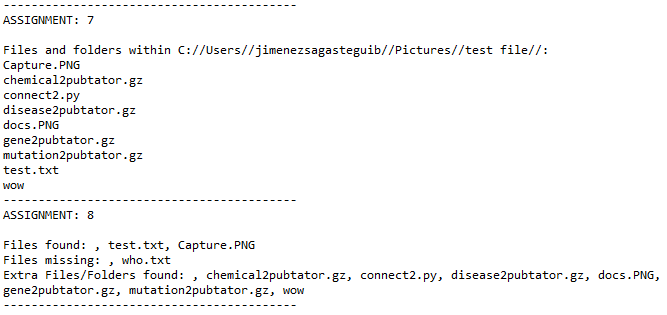

# fileManagement
This py program uses the module os. Here the user inputs the folder and file names it wants checked and the program will output the the files that are found per users request, ones that ar missing, and the extra files/folders found. For this program to work it requires two arguments: 
* Directory path
* File names with the flag '-f' or '--files' before each name
* Example: "C:\\Users\\username\\Downloads" -f test.txt -f Capture.PNG -f who.txt
            C:/Users/username/Pictures/"test file"/ -f test.txt -f Capture.PNG --files who.txt
            C:/Users/username/Pictures/ --files test.txt --files Capture.PNG --files who.txt
            
            
## Results

